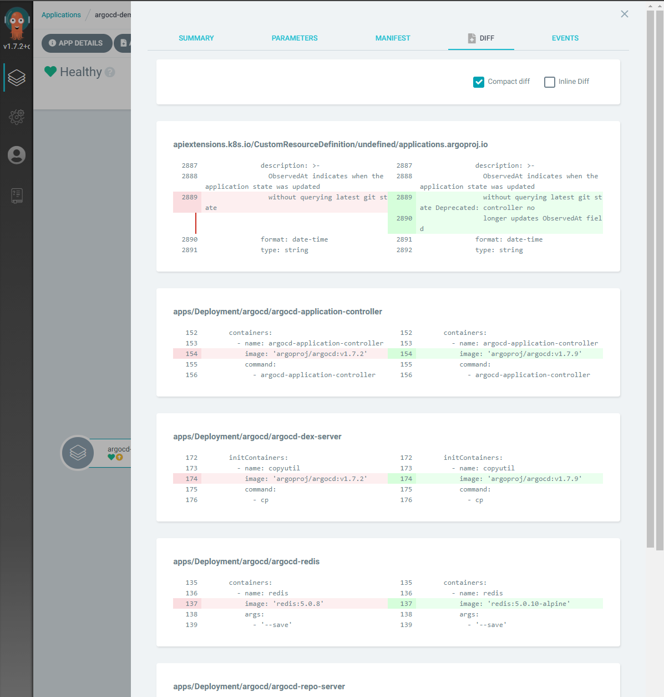

# argocd-demo
k8s GitOps demo for ArgoCD

Version：
* eks:v1.18
* argocd:v1.7.2 → v1.7.9

---

ArgoCDは、
Kubernetes用の宣言型の[GitOps](https://www.weave.works/technologies/gitops/)継続的REDME.mdデリバリーツールです。  


https://argoproj.github.io/argo-cd/

類似ツールとしてはFlux、JenkinsXなどがありますが、使いやすさ、導入の容易さ、
拡張性（Helmやkustomizeなどにも対応）などの利点があり広く利用されています。


※出典：[Argo CD - Declarative GitOps CD for Kubernetes : Overview - Architecture](https://argoproj.github.io/argo-cd/assets/argocd_architecture.png)

このGitリポジトリのマニフェストをSSOT（Single Source of Truth：信頼できる唯一の情報源）
として [AWS EKS](https://aws.amazon.com/jp/eks/) クラスタ上に構築したArgoCDを使用して
k8sリソースとGitリポジトリを常に同期した状態に保つGitOpsのデモを行うサンプルです。

---

## デモの流れ
* EKSクラスタ構築
* ArgoCDインストール
* ArgoCD実行環境設定
* ArgoCDでGitOpsする（初期構築）
* デモアプリへアクセス
* ArgoCDでGitOpsする（バージョンアップ）

---
# デモを行う

## EKSクラスタ構築
EKSクラスタを構築する。
```
eksctl create cluster -f eks-cluster/cluster.yaml
```
実行結果（※正常に終了）
```
[ℹ]  eksctl version 0.34.0
[ℹ]  using region us-west-2
[ℹ]  setting availability zones to [us-west-2d us-west-2b us-west-2a]
[ℹ]  subnets for us-west-2d - public:192.168.0.0/19 private:192.168.96.0/19
[ℹ]  subnets for us-west-2b - public:192.168.32.0/19 private:192.168.128.0/19
[ℹ]  subnets for us-west-2a - public:192.168.64.0/19 private:192.168.160.0/19
[ℹ]  using Kubernetes version 1.18
[ℹ]  creating EKS cluster "argocd-demo" in "us-west-2" region with managed nodes
[ℹ]  1 nodegroup (argocd-demo-ng) was included (based on the include/exclude rules)
[ℹ]  will create a CloudFormation stack for cluster itself and 0 nodegroup stack(s)
[ℹ]  will create a CloudFormation stack for cluster itself and 1 managed nodegroup stack(s)
[ℹ]  if you encounter any issues, check CloudFormation console or try 'eksctl utils describe-stacks --region=us-west-2 --cluster=argocd-demo'
[ℹ]  CloudWatch logging will not be enabled for cluster "argocd-demo" in "us-west-2"
[ℹ]  you can enable it with 'eksctl utils update-cluster-logging --enable-types={SPECIFY-YOUR-LOG-TYPES-HERE (e.g. all)} --region=us-west-2 --cluster=argocd-demo'
[ℹ]  Kubernetes API endpoint access will use default of {publicAccess=true, privateAccess=false} for cluster "argocd-demo" in "us-west-2"
[ℹ]  2 sequential tasks: { create cluster control plane "argocd-demo", 3 sequential sub-tasks: { no tasks, create addons, create managed nodegroup "argocd-demo-ng" } }
[ℹ]  building cluster stack "eksctl-argocd-demo-cluster"
[ℹ]  deploying stack "eksctl-argocd-demo-cluster"
[ℹ]  building managed nodegroup stack "eksctl-argocd-demo-nodegroup-argocd-demo-ng"
[ℹ]  deploying stack "eksctl-argocd-demo-nodegroup-argocd-demo-ng"
[ℹ]  waiting for the control plane availability...
[✔]  saved kubeconfig as "C:\\Users\\xxxxxx.xxxxxx/.kube/config"
[ℹ]  no tasks
[✔]  all EKS cluster resources for "argocd-demo" have been created
[ℹ]  nodegroup "argocd-demo-ng" has 3 node(s)
[ℹ]  node "ip-xxx-xxx-xxx-xxx.us-west-2.compute.internal" is ready
[ℹ]  node "ip-xxx-xxx-xxx-xxx.us-west-2.compute.internal" is ready
[ℹ]  node "ip-xxx-xxx-xxx-xxx.us-west-2.compute.internal" is ready
[ℹ]  waiting for at least 1 node(s) to become ready in "argocd-demo-ng"
[ℹ]  nodegroup "argocd-demo-ng" has 3 node(s)
[ℹ]  node "ip-xxx-xxx-xxx-xxx.us-west-2.compute.internal" is ready
[ℹ]  node "ip-xxx-xxx-xxx-xxx.us-west-2.compute.internal" is ready
[ℹ]  node "ip-xxx-xxx-xxx-xxx.us-west-2.compute.internal" is ready
[ℹ]  kubectl command should work with "C:\\Users\\xxxxxx.xxxxxx/.kube/config", try 'kubectl get nodes'
[✔]  EKS cluster "argocd-demo" in "us-west-2" region is ready
```
構築したEKSクラスタを確認する。
```
kubectl get nodes

NAME                                            STATUS   ROLES    AGE   VERSION
ip-xxx-xxx-xxx-xxx.us-west-2.compute.internal   Ready    <none>   77s   v1.18.9-eks-d1db3c
ip-xxx-xxx-xxx-xxx.us-west-2.compute.internal   Ready    <none>   93s   v1.18.9-eks-d1db3c
ip-xxx-xxx-xxx-xxx.us-west-2.compute.internal   Ready    <none>   95s   v1.18.9-eks-d1db3c
```
全ノードが Ready になっていればOKです。

---

## ArgoCDインストール
名前空間を作成する。
```
kubectl create namespace argocd
```
ArgoCDをインストールする。
```
kubectl apply -n argocd -f argocd/install.yaml
```
※[インストール用yaml](https://raw.githubusercontent.com/argoproj/argo-cd/stable/manifests/install.yaml)の取得元は[ArgoCD公式ページ](https://argoproj.github.io/argo-cd/)の「Getting Started」を参照してください。

実行結果（※正常に終了）
```
customresourcedefinition.apiextensions.k8s.io/applications.argoproj.io created
customresourcedefinition.apiextensions.k8s.io/appprojects.argoproj.io created
serviceaccount/argocd-application-controller created
serviceaccount/argocd-dex-server created
serviceaccount/argocd-server created
role.rbac.authorization.k8s.io/argocd-application-controller created
role.rbac.authorization.k8s.io/argocd-dex-server created
role.rbac.authorization.k8s.io/argocd-server created
clusterrole.rbac.authorization.k8s.io/argocd-application-controller created
clusterrole.rbac.authorization.k8s.io/argocd-server created
rolebinding.rbac.authorization.k8s.io/argocd-application-controller created
rolebinding.rbac.authorization.k8s.io/argocd-dex-server created
rolebinding.rbac.authorization.k8s.io/argocd-server created
clusterrolebinding.rbac.authorization.k8s.io/argocd-application-controller created
clusterrolebinding.rbac.authorization.k8s.io/argocd-server created
configmap/argocd-cm created
configmap/argocd-gpg-keys-cm created
configmap/argocd-rbac-cm created
configmap/argocd-ssh-known-hosts-cm created
configmap/argocd-tls-certs-cm created
secret/argocd-secret created
service/argocd-dex-server created
service/argocd-metrics created
service/argocd-redis created
service/argocd-repo-server created
service/argocd-server-metrics created
service/argocd-server created
deployment.apps/argocd-application-controller created
deployment.apps/argocd-dex-server created
deployment.apps/argocd-redis created
deployment.apps/argocd-repo-server created
deployment.apps/argocd-server created
```
ArgoCD画面へアクセスするためのURLを確認する。
```
kubectl get svc argocd-server -n argocd

NAME                    TYPE           CLUSTER-IP         EXTERNAL-IP                                     PORT(S)                      AGE
argocd-server           LoadBalancer   xxx.xxx.xxx.xxx    xxxxxx-9999999999.us-west-2.elb.amazonaws.com   80:32249/TCP,443:30389/TCP   34s
```
Webブラウザで ArgoCD 画面へアクセスする。  
https://xxxxxx-9999999999.us-west-2.elb.amazonaws.com/


初期パスワード取得  
```
kubectl get pod -n argocd -l app.kubernetes.io/name=argocd-server
```
※初期ユーザ admin のパスワードは argocd-server のPod名です。

---

## ArgoCD実行環境設定
Settingsメニューから連携するGitリポジトリを登録する。

* ArgoCD :  
https://github.com/orinbou/argocd-demo.git


* Sock Shop :   
https://github.com/orinbou/microservices-demo.git


applicationsメニューから管理するアプリケーションを登録する。

* ArgoCD : 自分自身をアプリケーションとして管理する  


* Sock Shop : A Microservice Demo Application  


---

## ArgoCDでGitOpsする（初期構築）
前述のセットアップが完了すると２つのアプリケーションが管理できるようになります。

まだマニフェストと同期されていないため黄色で「OutOfSync」と表示されています。

それぞれのアプリケーションをGitリポジトリのマニフェストファイルと同期させます。

* ArgoCD :  
同期させる前にマニフェストの差分を確認します。  
（左：現在の実行環境のマニフェスト、右：Gitリポジトリのマニフェスト）

初回のみ表示される下記の差分は、ArgoCD管理用に追加されるメタデータ（ラベル）なので無視できます。
（※Gitリポジトリのマニフェストには反映されません）
  ```
  app.kubernetes.io/instance: argocd-demo
  ```
  マニフェストファイルと同期（SYNCHRONIZE）させます。


* Sock Shop :  
同期させる前にマニフェストの差分を確認します。  
（左：現在の実行環境のマニフェスト、右：Gitリポジトリのマニフェスト）


  まだデプロイされていないアプリケーションは、全てが差分として表示されます。

  マニフェストファイルと同期（SYNCHRONIZE）させます。


アプリケーションの同期が完了するとアプリケーションがArgoCDの管理下となります。

マニフェストと同期されたため緑色で「Sync」と表示されています。

---

## デモアプリへアクセス
デモアプリ（Sock Shop）画面へアクセスするためのURLを確認する。
```
kubectl get svc front-end -n sock-shop

NAME        TYPE           CLUSTER-IP        EXTERNAL-IP                                     PORT(S)        AGE
front-end   LoadBalancer   xxx.xxx.xxx.xxx   yyyyyy-1234567890.us-west-2.elb.amazonaws.com   80:30001/TCP   7m46s
```
Webブラウザでデモアプリ（Sock Shop）画面へアクセスする。  
http://yyyyyy-1234567890.us-west-2.elb.amazonaws.com/


コマンド（kubectl）でデモアプリのk8sリソース（Pod）の状態を確認する。
```
kubectl get pod -n sock-shop

NAME                            READY   STATUS    RESTARTS   AGE
carts-7bbbd7779d-gd5xl          1/1     Running   0          16m
carts-db-84b777d9c-wd8g4        1/1     Running   0          16m
catalogue-8684f655d9-m2gqh      1/1     Running   0          16m
catalogue-db-5579f7f4cb-vhhcb   1/1     Running   0          16m
front-end-6f5fc69d6-kzr4r       1/1     Running   0          16m
orders-7ccf68495-mq4d7          1/1     Running   0          16m
orders-db-77c46b9c85-8trt8      1/1     Running   0          16m
payment-74976d749f-bsn5h        1/1     Running   0          16m
queue-master-799b6b57d5-t2jrq   1/1     Running   0          16m
rabbitmq-8458d7d4c-qwc8s        1/1     Running   0          16m
shipping-5c89f4886c-vvjdb       1/1     Running   0          16m
user-d6c48f668-6zm97            1/1     Running   0          16m
user-db-5cdfd6d44b-mnbbf        1/1     Running   0          16m
```
ArgoCD画面からデモアプリのk8sリソース（Pod）の状態を確認する。


コマンド（kubectl）でデモアプリのk8sリソース（Pod）の詳細を確認する。
```
kubectl describe pod carts-7bbbd7779d-gd5xl -n sock-shop
```
実行結果
```
Name:         carts-7bbbd7779d-gd5xl
Namespace:    sock-shop
Priority:     0
Node:         ip-xxx-xxx-xxx-xxx.us-west-2.compute.internal/xxx-xxx-xxx-xxx
Start Time:   Sat, 19 Dec 2020 23:14:23 +0900
Labels:       name=carts
              pod-template-hash=7bbbd7779d
Annotations:  kubernetes.io/psp: eks.privileged
Status:       Running
IP:           xxx-xxx-xxx-xxx
IPs:
  IP:           xxx-xxx-xxx-xxx
Controlled By:  ReplicaSet/carts-7bbbd7779d
Containers:
  carts:
    Container ID:   docker://508c46d3567754e57b68d73e13020d2242217c5e2c9c96bcda55e65042832378
    Image:          weaveworksdemos/carts:0.4.8
    Image ID:       docker-pullable://weaveworksdemos/carts@sha256:434d2f5a6e0e8beef1f253fe96f45b8437a703125fc003434c5282ecf8969a4f
    Port:           80/TCP
    Host Port:      0/TCP
    State:          Running
      Started:      Sat, 19 Dec 2020 23:14:35 +0900
    Ready:          True
    Restart Count:  0
    Environment:
      ZIPKIN:     zipkin.jaeger.svc.cluster.local
      JAVA_OPTS:  -Xms64m -Xmx128m -XX:PermSize=32m -XX:MaxPermSize=64m -XX:+UseG1GC -Djava.security.egd=file:/dev/urandom
    Mounts:
      /tmp from tmp-volume (rw)
      /var/run/secrets/kubernetes.io/serviceaccount from default-token-wzp98 (ro)
Conditions:
  Type              Status
  Initialized       True
  Ready             True
  ContainersReady   True
  PodScheduled      True
Volumes:
  tmp-volume:
    Type:       EmptyDir (a temporary directory that shares a pod's lifetime)
    Medium:     Memory
    SizeLimit:  <unset>
  default-token-wzp98:
    Type:        Secret (a volume populated by a Secret)
    SecretName:  default-token-wzp98
    Optional:    false
QoS Class:       BestEffort
Node-Selectors:  beta.kubernetes.io/os=linux
Tolerations:     node.kubernetes.io/not-ready:NoExecute for 300s
                 node.kubernetes.io/unreachable:NoExecute for 300s
Events:
  Type    Reason     Age   From                                                   Message
  ----    ------     ----  ----                                                   -------
  Normal  Scheduled  27m   default-scheduler                                      Successfully assigned sock-shop/carts-7bbbd7779d-gd5xl to ip-xxx-xxx-xxx-xxx.us-west-2.compute.internal
  Normal  Pulling    27m   kubelet, ip-xxx-xxx-xxx-xxx.us-west-2.compute.internal  Pulling image "weaveworksdemos/carts:0.4.8"
  Normal  Pulled     27m   kubelet, ip-xxx-xxx-xxx-xxx.us-west-2.compute.internal  Successfully pulled image "weaveworksdemos/carts:0.4.8"
  Normal  Created    27m   kubelet, ip-xxx-xxx-xxx-xxx.us-west-2.compute.internal  Created container carts
  Normal  Started    27m   kubelet, ip-xxx-xxx-xxx-xxx.us-west-2.compute.internal  Started container carts
```
ArgoCD画面からデモアプリのk8sリソース（Pod）の詳細を確認する。
* SUMMARY

* EVENTS


コマンド（kubectl）でデモアプリのk8sリソース（Pod）のログを確認する。
```
kubectl logs carts-7bbbd7779d-gd5xl -n sock-shop
```
実行結果
```
OpenJDK 64-Bit Server VM warning: ignoring option PermSize=32m; support was removed in 8.0
OpenJDK 64-Bit Server VM warning: ignoring option MaxPermSize=64m; support was removed in 8.0
2020-12-19 14:14:44.663  INFO [bootstrap,,,] 6 --- [           main] s.c.a.AnnotationConfigApplicationContext : Refreshing org.springframework.context.annotation.AnnotationConfigApplicationContext@51521cc1: startup date [Sat Dec 19 14:14:44 GMT 2020]; root of context hierarchy
2020-12-19 14:14:49.155  INFO [bootstrap,,,] 6 --- [           main] trationDelegate$BeanPostProcessorChecker : Bean 'configurationPropertiesRebinderAutoConfiguration' of type [class org.springframework.cloud.autoconfigure.ConfigurationPropertiesRebinderAutoConfiguration$$EnhancerBySpringCGLIB$$b894f39] is not eligible for getting processed by all BeanPostProcessors (for example: not eligible for auto-proxying)

  .   ____          _            __ _ _
 /\\ / ___'_ __ _ _(_)_ __  __ _ \ \ \ \
( ( )\___ | '_ | '_| | '_ \/ _` | \ \ \ \
 \\/  ___)| |_)| | | | | || (_| |  ) ) ) )
  '  |____| .__|_| |_|_| |_\__, | / / / /
 =========|_|==============|___/=/_/_/_/
 :: Spring Boot ::        (v1.4.4.RELEASE)

2020-12-19 14:14:51.754  INFO [carts,,,] 6 --- [           main] works.weave.socks.cart.CartApplication   : No active profile set, falling back to default profiles: default
2020-12-19 14:14:51.841  INFO [carts,,,] 6 --- [           main] ationConfigEmbeddedWebApplicationContext : Refreshing org.springframework.boot.context.embedded.AnnotationConfigEmbeddedWebApplicationContext@649d209a: startup date [Sat Dec 19 14:14:51 GMT 2020]; parent: org.springframework.context.annotation.AnnotationConfigApplicationContext@51521cc1
2020-12-19 14:14:57.688  INFO [carts,,,] 6 --- [           main] o.s.b.f.s.DefaultListableBeanFactory     : Overriding bean definition for bean 'managementServletContext' with a different definition: replacing [Root bean: class [null]; scope=; abstract=false; lazyInit=false; autowireMode=3; dependencyCheck=0; autowireCandidate=true; primary=false; factoryBeanName=org.springframework.boot.actuate.autoconfigure.EndpointWebMvcHypermediaManagementContextConfiguration; factoryMethodName=managementServletContext; initMethodName=null; destroyMethodName=(inferred); defined in class path resource [org/springframework/boot/actuate/autoconfigure/EndpointWebMvcHypermediaManagementContextConfiguration.class]] with [Root bean: class [null]; scope=; abstract=false; lazyInit=false; autowireMode=3; dependencyCheck=0; autowireCandidate=true; primary=false; factoryBeanName=org.springframework.boot.actuate.autoconfigure.EndpointWebMvcAutoConfiguration; factoryMethodName=managementServletContext; initMethodName=null; destroyMethodName=(inferred); defined in class path resource [org/springframework/boot/actuate/autoconfigure/EndpointWebMvcAutoConfiguration.class]]
2020-12-19 14:14:58.715  WARN [carts,,,] 6 --- [           main] o.s.c.a.ConfigurationClassPostProcessor  : Cannot enhance @Configuration bean definition 'refreshScope' since its singleton instance has been created too early. The typical cause is a non-static @Bean method with a BeanDefinitionRegistryPostProcessor return type: Consider declaring such methods as 'static'.
2020-12-19 14:14:59.591  INFO [carts,,,] 6 --- [           main] o.s.cloud.context.scope.GenericScope     : BeanFactory id=5e44614a-7369-3438-a326-d1b2bda21648
2020-12-19 14:15:00.384  INFO [carts,,,] 6 --- [           main] trationDelegate$BeanPostProcessorChecker : Bean 'org.springframework.cloud.sleuth.instrument.async.AsyncDefaultAutoConfiguration$DefaultAsyncConfigurerSupport' of type [class org.springframework.cloud.sleuth.instrument.async.AsyncDefaultAutoConfiguration$DefaultAsyncConfigurerSupport$$EnhancerBySpringCGLIB$$2cb0e9ff] is not eligible for getting processed by all BeanPostProcessors (for example: not eligible for auto-proxying)
2020-12-19 14:15:01.693  INFO [carts,,,] 6 --- [           main] trationDelegate$BeanPostProcessorChecker : Bean 'org.springframework.cloud.autoconfigure.ConfigurationPropertiesRebinderAutoConfiguration' of type [class org.springframework.cloud.autoconfigure.ConfigurationPropertiesRebinderAutoConfiguration$$EnhancerBySpringCGLIB$$b894f39] is not eligible for getting processed by all BeanPostProcessors (for example: not eligible for auto-proxying)
2020-12-19 14:15:01.791  INFO [carts,,,] 6 --- [           main] trationDelegate$BeanPostProcessorChecker : Bean 'org.springframework.cloud.sleuth.instrument.web.TraceWebAutoConfiguration' of type [class org.springframework.cloud.sleuth.instrument.web.TraceWebAutoConfiguration$$EnhancerBySpringCGLIB$$ecb4cb09] is not eligible for getting processed by all BeanPostProcessors (for example: not eligible for auto-proxying)
2020-12-19 14:15:05.023  INFO [carts,,,] 6 --- [           main] s.b.c.e.t.TomcatEmbeddedServletContainer : Tomcat initialized with port(s): 80 (http)
2020-12-19 14:15:05.075  INFO [carts,,,] 6 --- [           main] o.apache.catalina.core.StandardService   : Starting service Tomcat
2020-12-19 14:15:05.081  INFO [carts,,,] 6 --- [           main] org.apache.catalina.core.StandardEngine  : Starting Servlet Engine: Apache Tomcat/8.5.11
2020-12-19 14:15:05.479  INFO [carts,,,] 6 --- [ost-startStop-1] o.a.c.c.C.[Tomcat].[localhost].[/]       : Initializing Spring embedded WebApplicationContext
2020-12-19 14:15:05.487  INFO [carts,,,] 6 --- [ost-startStop-1] o.s.web.context.ContextLoader            : Root WebApplicationContext: initialization completed in 13646 ms
：（※以下省略）
```
ArgoCD画面からデモアプリのk8sリソース（Pod）のログを確認する。
* LOGS


見やすいですね。コマンドほど融通は利きませんが、なかなか便利です。

---

## ArgoCDでGitOpsする（バージョンアップ）
ArgoCDのバージョンアップ（argocd:v1.7.2 → v1.7.9）を実施する。

修正したマニフェストをGitへPushすると黄色で「OutOfSync」と表示されます。

同期させる前にマニフェストの差分を確認します。  
（左：現在の実行環境のマニフェスト、右：Gitリポジトリのマニフェスト）


修正したマニフェストファイルと同期（SYNCHRONIZE）させます。

  
しばらく待つとバージョンアップが完了します。

マニフェストと同期されたため緑色で「Sync」と表示されています。

---

以上で、GitOpsのデモは終了です。お疲れ様でした<(_ _)>
